# 📸 SRGAN: Super-Resolution Generative Adversarial Network (4× Upscaling)

> **Authors**: Abdallah Jamal Al-Harrem, Hossam Shehadeh
> **Project Type**: Advanced Deep Learning | Computer Vision
> **Focus**: 4× Single Image Super-Resolution (SISR) for Facial & Natural Images

---

## 🌟 Super-Resolution in Action

> ⚡ _Before diving in, here’s what SRGAN can do..._

| Low Resolution          | SRGAN Output              | Real Image               |
| ----------------------- | ------------------------- | ------------------------ |
| 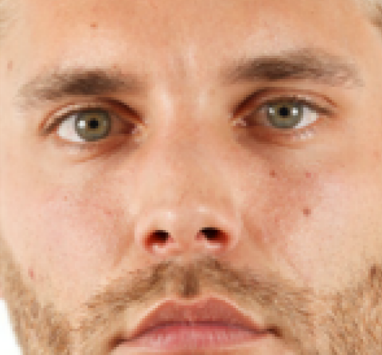   |       | 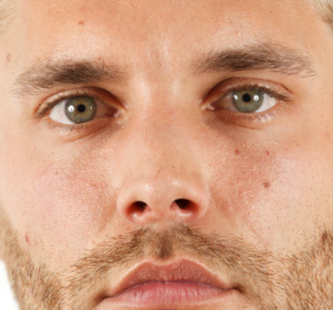   |
| 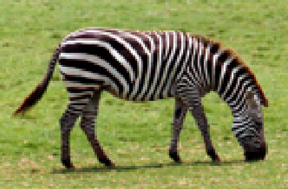 | 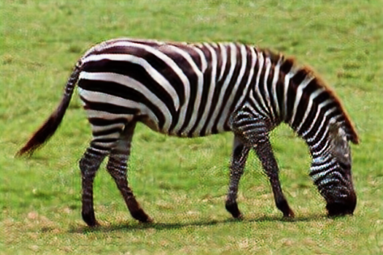 | 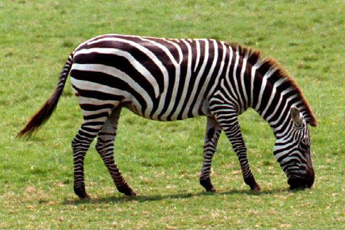 |

## 🚀 Project Overview

This project presents a **dual-model SRGAN** system for **4× single image super-resolution**. It aims to reconstruct high-quality, realistic high-resolution (HR) images from their low-resolution (LR) counterparts using a deep-learning-based perceptual framework.

Key innovations include:

- 🧠 **Two specialized models**:
  - Facial SRGAN trained on **CelebA**
  - General SRGAN trained on **DIV2K**
- ⚙️ **Two-stage training** with pixel-wise loss followed by adversarial fine-tuning
- 🧪 **Multi-metric evaluation**: PSNR, SSIM, and LPIPS
- 🔄 **Cross-domain generalization** analysis using Set14 benchmark

---

## 📂 Datasets

| Dataset                                                 | Domain         | Purpose              | Samples                      |
| ------------------------------------------------------- | -------------- | -------------------- | ---------------------------- |
| [CelebA](http://mmlab.ie.cuhk.edu.hk/projects/CelebA.html) | Faces          | Facial SR model      | 30,000 images                |
| [DIV2K](https://data.vision.ee.ethz.ch/cvl/DIV2K/)         | Natural images | General SR model     | 800 training, 100 validation |
| [Set14](https://github.com/jbhuang0604/SelfExSR)           | Mixed          | Evaluation benchmark | 14 standard images           |

---
## 🗂️ Project Structure

```
SRGAN-Project/
│
├── README.md                    ← Project documentation
├── requirements.txt             ← Python dependencies
├── .gitignore                   ← Ignore checkpoints, logs, temp files
│
├── samples/                     ← Visual examples for README
│   ├── lowcel.png
│   ├── srgan.png
│   ├── realcel.png
│   ├── zebraLow.png
│   ├── zebrasrgan.png
│   ├── zebraReal.png
│   └── e1.png ... e5.png
│
├── docs/                        ← Architecture diagrams and documentation
│   ├── generator_architecture.png
│   └── discriminator_architecture.png
│
├── src/                         ← Main source code and training notebooks
│   ├── celeba/
│   │   ├── train_celeba.ipynb   ← CelebA SRGAN training pipeline
│   │   ├── logs/                ← Training logs (loss, metrics , PSNR, SSIM, etc.)
│   │   └── models/              ← Checkpoints: best_psnr.pth, best_lpips.pth, etc.
│   │
│   └── div2k/
│       ├── train_div2k.ipynb    ← DIV2K SRGAN training pipeline
│       ├── logs/                ← Training logs (loss, metrics , PSNR, SSIM, etc.)
│       └── models/              ← Checkpoints:  best_psnr.pth, best_lpips.pth, etc.
│
└── reports/
    ├── SRGAN_Report_Format1.pdf
    ├── SRGAN_Report_Format2.pdf
```
---

## 🧠 Methodology and Architecture

### 🔁 Two-Stage Training Strategy

The SRGAN system uses a robust two-stage training methodology to optimize both pixel accuracy and perceptual realism:

#### **Stage 1 – SRResNet Pre-training**

- Generator trained independently using **L1 pixel loss**
- Establishes a strong baseline with high PSNR performance
- Provides stable initialization for GAN fine-tuning
- Runs for variable epochs until convergence

#### **Stage 2 – Adversarial Fine-tuning**

- Joint training of **generator and discriminator**
- Uses a **multi-component loss function**:
  ```
   L_total = α·L_pixel + β·L_content + γ·L_adv
  ```
- Incorporates adversarial feedback to enhance texture generation and realism

---

### 🧠 Generator Architecture (SRResNet-Based)

The generator follows a deep residual architecture optimized for perceptual super-resolution.

| Stage                   | Components                                                                                        |
| ----------------------- | ------------------------------------------------------------------------------------------------- |
| **Input Layer**   | `Conv(9×9, 64) + PReLU`                                                                        |
| **Residual Body** | `16 × ResidualBlock:` each block = `[Conv(3×3, 64) + BN + PReLU] × 2` with skip connection |
| **Post-Residual** | `Conv(3×3, 64) + BN + Global Skip Connection`                                                  |
| **Upsampling**    | `2 × SubPixelConv:` each block = `Conv(3×3, 256) + PixelShuffle(2) + PReLU`                 |
| **Output Layer**  | `Conv(9×9, 3) + Tanh`                                                                          |

📐 **Full Generator Diagram**

Click to zoom:

<a href="docs/generator_architecture.png" target="_blank">
  
</a>

Or click the link to view the full-resolution image directly:  
➡️ [Generator Architecture](samples/generator_architecture.png)


**Key Design Choices:**

- ✅ **16 Residual Blocks**: Strong expressivity with efficient computation
- 🔁 **Global Skip Connection**: Preserves low-frequency information
- 🧠 **PReLU Activation**: Avoids vanishing gradients in deep architectures
- 🌀 **Sub-pixel Convolution**: Efficient, learned 4× upsampling
- ⚖️ **Batch Normalization**: Stabilizes training dynamics

---

### 🛡️ Discriminator Architecture (VGG-Inspired)

The discriminator is designed for binary classification between real HR images and generated SR images.

| Stage                          | Components                                                        |
| ------------------------------ | ----------------------------------------------------------------- |
| **Input**                | 96×96×3 HR or SR image                                          |
| **Convolutional Blocks** | `8 × ConvBlocks:`                                              |
|                                | Pattern :`[Conv(3×3) + BN + LeakyReLU(0.2)]`                   |
|                                | Channels :`64 → 128 → 128 → 256 → 256 → 512 → 512 → 512` |
|                                | Stride alternates between `1` and `2` for downsampling                      |
| **Global Avg Pooling**   | `AdaptiveAvgPool2d(6×6)`                                       |
| **Classifier**           | `Linear(18432 → 1024) + LeakyReLU → Linear(1024 → 1)`        |

📐 **Full Discriminator Diagram**

Click to zoom:

<a href="docs/discriminator_architecture.png" target="_blank">
  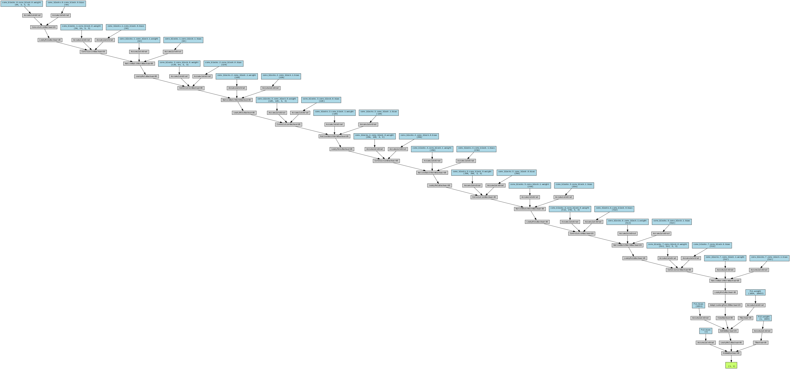
</a>

Or click the link to view the full-resolution image directly:  
➡️ [Discriminator Architecture](samples/discriminator_architecture.png)


**Architecture Rationale:**

- 🎯 **Progressive Channel Growth**: Captures features from edges to textures
- ➡️ **Strided Convolutions**: Replaces max-pooling for downsampling
- ⚡ **LeakyReLU Activations**: Prevents gradient dying in the discriminator
- 📐 **Adaptive Pooling**: Ensures consistent feature shape across samples

### ⚖️ Loss Weights

- Pixel Loss `α = 1.0`
- Content Loss `β = 0.006`
- Adversarial Loss `γ = 0.001`

---

## 🧠 Evaluation Metrics

| Metric          | Description                                           |
| --------------- | ----------------------------------------------------- |
| **PSNR**  | Pixel-wise accuracy (dB)                              |
| **SSIM**  | Structural fidelity to ground truth                   |
| **LPIPS** | Learned perceptual similarity (deep feature distance) |

📌 Separate model checkpoints were saved for each metric to enable application-specific selection.

---

## 💾 Comprehensive Checkpointing System

All training progress is tracked and saved through a robust checkpointing mechanism:

| Checkpoint File               | Description                                       |
| ----------------------------- | ------------------------------------------------- |
| `checkpoint_latest.pth`     | Latest training state (for resumption)            |
| `checkpoint_best_psnr.pth`  | Model with highest PSNR                           |
| `checkpoint_best_ssim.pth`  | Model with best SSIM score                        |
| `checkpoint_best_lpips.pth` | Model with lowest LPIPS (best perceptual quality) |
| `checkpoint_epoch_XX.pth`   | Periodic milestone checkpoints for traceability   |

> ✅ Supports training resumption, fine-tuning, and targeted deployment.

---

## 📈 Results Summary

### 🧑‍🦱 CelebA (Facial Super-Resolution)

| Model               | PSNR ↑ | SSIM ↑ | LPIPS ↓         |
| ------------------- | ------- | ------- | ---------------- |
| SRResNet (Baseline) | 42.70   | 0.9669  | 0.0833           |
| SRGAN (Best PSNR)   | 42.38   | 0.9642  | 0.0566           |
| SRGAN (Best LPIPS)  | 41.43   | 0.9572  | **0.0368** |

### 🌄 DIV2K (Natural Image Super-Resolution)

| Model                  | PSNR ↑         | SSIM ↑          | LPIPS ↓         |
| ---------------------- | --------------- | ---------------- | ---------------- |
| SRResNet (Baseline)    | 23.25           | 0.6576           | 0.3616           |
| SRGAN (Best PSNR/SSIM) | **25.15** | **0.7191** | 0.1901           |
| SRGAN (Best LPIPS)     | 24.80           | 0.7038           | **0.1577** |

---

## 🔍 Insights & Takeaways

- 🎨 **GANs significantly improve perceptual quality**, even with a small drop in PSNR.
- 🔁 **CelebA-trained models generalize well** to natural images (Set14).
- 🔍 **LPIPS outperforms PSNR** for visual similarity evaluation.
- 📉 **Data diversity > data volume**: DIV2K (800 samples) > CelebA (24,000) on cross-domain generalization.
- 🧠 **Multi-metric optimization** enables application-specific deployment.

---

## 🔭 Future Enhancements

- 📈 Progressive resolution scaling (for 4K+ upscaling)
- 🧱 Integrate **RRDB blocks** (ESRGAN) for better texture synthesis
- 🧠 Add **self-attention modules** to improve fine detail
- 🧭 Saliency-aware cropping to generalize CelebA-style specialization

---

## 💡 Applications

- 🧑‍🦱 **Facial image enhancement**
- 🛰️ **Satellite and aerial image sharpening**
- 🧬 **Medical image diagnostics**
- 🖼️ **Upscaling low-res photos & videos**
- 🧪 **Scientific imaging and restoration**

---

## 📚 References

- Goodfellow et al. (2014) — *Generative Adversarial Networks*
- Ledig et al. (2017) — *Photo-Realistic SR using GANs (SRGAN)*
- Johnson et al. (2016) — *Perceptual Losses for SR*
- Zhang et al. (2018) — *LPIPS Metric*
- He et al. (2016) — *Residual Networks (ResNet)*

---

## 📎 License & Acknowledgments

This project is open-source and provided for academic and research purposes.
Datasets and pre-trained networks are credited to their original authors.

---

## 📸 Examples for some Images for all models

| Example       | -                 |
| ------------- | ----------------- |
| _Example 1_ | 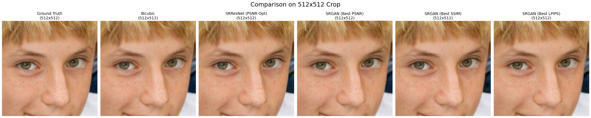 |
| _Example 2_ | 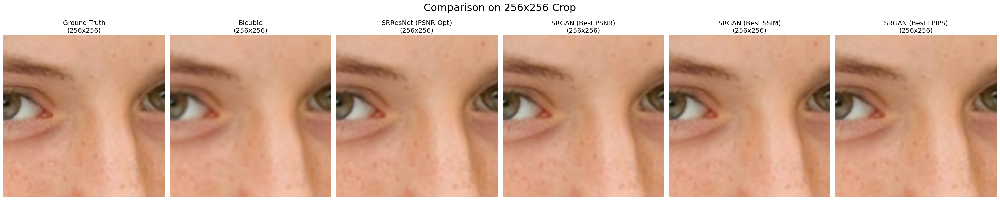 |
| _Example 3_ | 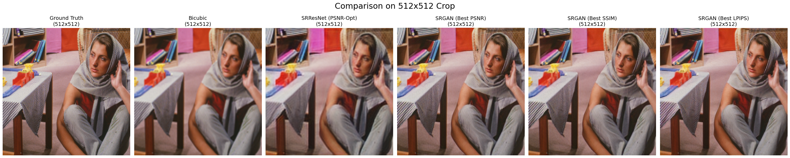 |
| _Example 4_ | 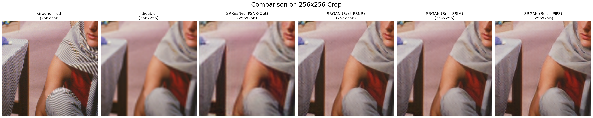 |
| _Example 5_ | 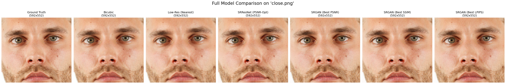 |
